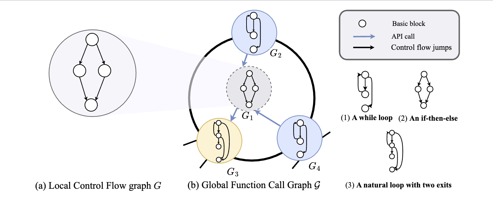
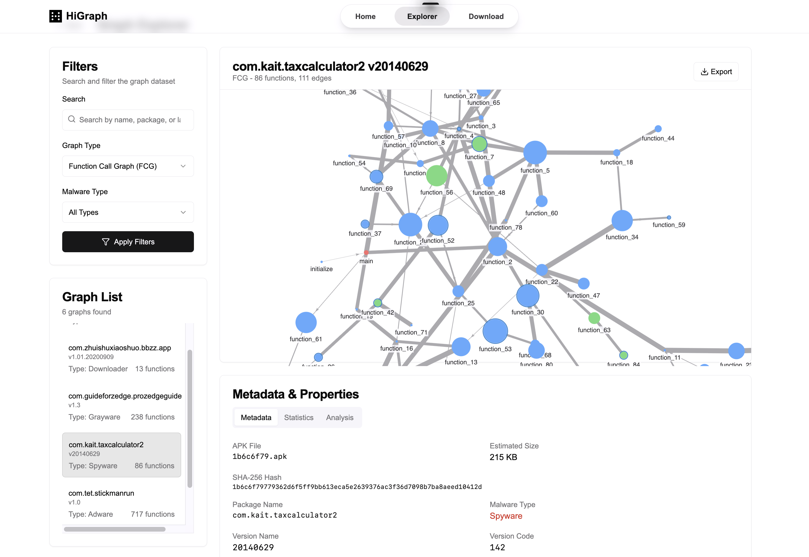

<h1 align="center"> HiGraph: A Large-Scale Hierarchical Graph Dataset </h1>

<div align="center">


<p><strong>Hierarchical Graph Dataset for Malware Analysis with Function Call Graphs and Control Flow Graphs</strong></p>


 
                
                
                
                
                

A comprehensive hierarchical graph-based dataset for malware analysis and detection.

[Overview](#overview) • [Dataset Statistics](#dataset-statistics) • [Interactive Explorer](#interactive-visualization) • [Download](#download-dataset) 

</div>

## Overview

**HiGraph** is a novel, large-scale dataset that models each application as a hierarchical graph: a local **Control Flow Graph (CFG)** capturing intra-function logic and a global **Function Call Graph (FCG)** capturing inter-function interactions.

Graph-based methods have shown great promise in malware analysis, yet the lack of large-scale, hierarchical graph datasets limits further advances in this field. This hierarchical design facilitates the development of robust detection models that are more resilient to obfuscation, model aging, and malware evolution.

<div align="center">



</div>

### Key Features

- 🔍 **Hierarchical Graph Structure**: Two-level representation with FCGs and CFGs
- 📈 **Large Scale**: 200M+ Control Flow Graphs and 595K+ Function Call Graphs
- 🏷️ **Rich Semantic Information**: Preserves crucial structural details for malware analysis
- 📊 **Comprehensive Coverage**: 11-year temporal span (2012-2022)
- 🎯 **Benchmark Ready**: Designed for advancing hierarchical graph learning in cybersecurity

## Dataset Statistics

<div align="center">


| Class | Time Period | # Apps | **Function Call Graph** || **Control Flow Graph** |||
|-------|-------------|--------|---------------------|--|--------------------|--|--|
|       |             |        | **Avg # Nodes** | **Avg # Edges** | **# Graphs** | **Avg # Nodes** | **Avg # Edges** |
| **Malicious** | 2012.01-2022.12 | 57,184 | 266.48 | 491.67 | 6,925,406 | 12.29 | 14.94 |
| **Benign** | 2012.01-2022.12 | 538,027 | 791.54 | 1,414.51 | 194,866,679 | 12.17 | 13.94 |

</div>

## Interactive Visualization

Explore the hierarchical structure of malware samples through our interactive visualization tool:

<div align="center">

🔗 **[Launch Interactive Explorer](https://higraph.org/)**

*Click to explore the complete dataset structure and sample graphs*


*Sample Function Call Graph (FCG) visualization*

</div>

## Download Dataset

Access the complete HiGraph dataset through multiple platforms:

<div align="center">

| Platform | Description | Link |
|----------|-------------|------|
| 🤗 **Hugging Face** | Primary dataset repository | [View on Hugging Face](https://huggingface.co/datasets/hzcheney/Hi-Graph/tree/main) |
| 🌐 **Project Page** | Interactive explorer | [HiGraph Explorer](https://higraph.org/) |

</div>

## Requirements
- Python >= 3.9
- torch==2.6.0
- torch-geometric==2.6.1

Install dependencies:

```bash
pip install -r requirements.txt
```

## 📄 License

This dataset is licensed under the **Creative Commons Attribution-NonCommercial-ShareAlike (CC-BY-NC-SA)** license. See the [LICENSE](LICENSE) file for details.

